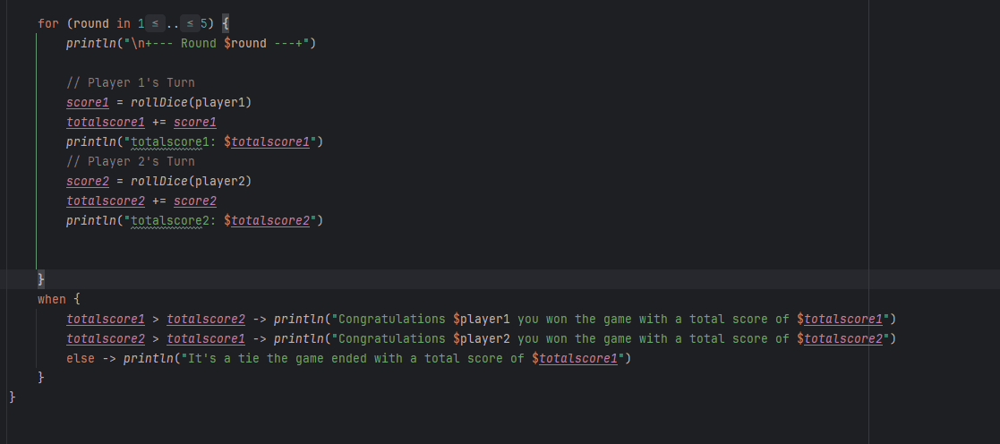
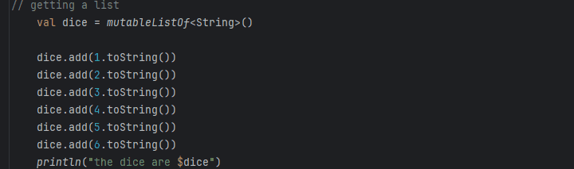
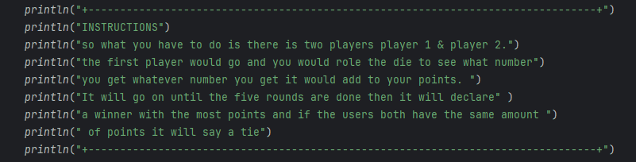

# Results of Testing

The test results show the actual outcome of the testing, following the [Test Plan](test-plan.md)

---

## player names

seeing if it will show the player names

### Test Data Used

I ran the code and I tested it

### Test Result

results: pass
---

## seeing the score
seeing if it will show the score

### Test Data Used
I ran the code and I tested it

### Test Result
the results should be that it should show the score

results: pass

---

## the dice rolling system
seeing if the dice rolling system works

### Test Data Used
I ran the code and I tested it

### Test Result

results: pass

---

## showing the instructions
showing the instructions at the start of the game

### Test Data Used
I ran the code and I tested it

### Test Result
the results should be it should show all the instructions

results: pass

---